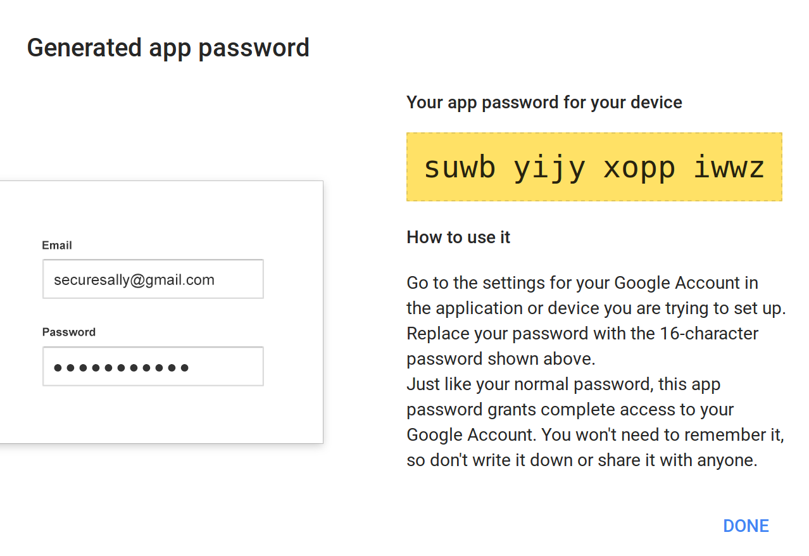

Basic configuration of Decidim
==============================

In this document, we'll finish the configuration of our installation of Decidim in order to make it capable of the most basic things, like sending emails. This configuration is independent of the operating system, that's why it's in a different file.

I'll assume here that you have a [running copy of Decidim](decidim-bionic.md) with empty content, no users or organizations created yet (a part from the system user admin created in the previous tutorial).

Email configuration
-------------------

The most important thing to configure is the capability for sending emails, otherwise users won't be able to register.

We'll configure here a Gmail account, which is suitable for small organizations in order to get started. Configure any other SMTP provider is analogous.

> **NOTE:** Gmail has a limit of [500 recipients](https://support.google.com/mail/answer/22839?hl=en) per day (10000 per day if you are using Gsuite) and, therefore, is not recommended for medium/large production sites.
> 
> Another drawback of using Gmail is that the "From" field of the email is going to be rewritten no matter what we configure in Decidim. This is going to affect how the end users sees the sender.
>
> You can use external email providers like [Amazon SES or similar](https://alternativeto.net/software/amazon-ses-simple-email-service-/). 

First, we need to configure our Gmail account in order to allow external SMTP activation. Gmail accounts may have SMTP sending disable by default if you have disabled the option "Enable less secure applications". In that case we need to create an application password for Decidim. 

**Option 1**, enable "less secure applications".

Go to this link (logged into your Gmail account), and activate the checkbox "Allow less secure apps":

https://myaccount.google.com/lesssecureapps

Official instructions from Google are here:
https://support.google.com/accounts/answer/6010255?hl=en


**Option 2**, create application specific password. If you have 2-factor authentication on your Gmail account you must choose this option.

1. Go to https://security.google.com/settings/security/apppasswords
and login using your Gmail account.
2. Create a new application password by selecting the option "Other" in the section "Device":<br><br>
3. A new window will appear with your password, copy it because you won't be able to read that password anymore once you close that window (you can always generate a news app password though).<br><br><br><br>Official documentation from Google is here:
https://support.google.com/mail/answer/185833?hl=en


We can now proceed to configure Decidim to use our credentials.

Let's edit our `application.yml` file and add some constants in that file:

```bash
nano ~/decidim-app/config/application.yml
```

Add these lines at the end, by using your own Gmail (or Gsuite) account and using your Gmail password if choosed the *Option 1* or the generated password in case of *Option 2*

```yaml
SMTP_USERNAME: my-decidim@gmail.com
SMTP_PASSWORD: suwbyijyxoppiwwz
SMTP_ADDRESS: smtp.gmail.com
SMTP_DOMAIN: gmail.com
```

If you are using Gsuite, replace `gmail.com` with your own domain (except the line SMTP_ADDRESS).

Now, we need to add a processor to Ruby on Rails that will actually send the emails. There's several options here, as usuall we are going to use the simplest one. 

In our Gemfile (if you followed the previous guide), we added the Gem `delayed_job_active_record`, ensure that your `Gemfile` has it:

```ruby
group :production do
  gem "passenger"
  gem 'delayed_job_active_record'
  gem "daemons"
end
```

We need to setup the delayed_job gem, run these commands:

```bash
cd ~/decidim-app
bundle install
bin/rails generate delayed_job:active_record
bin/rake db:migrate
```

Now, if you are using IPv6 in our system, you may encounter problems sending emails via external smtp servers. If you don't need IPv6 (if you don't know chances are that you don't), I'd recommend to disable it. To do that edit the file `/etc/sysctl.conf`:

```nano
sudo nano /etc/sysctl.conf
```

And add at the end of the file these lines:

```ini
#disable ipv6
net.ipv6.conf.all.disable_ipv6 = 1
net.ipv6.conf.default.disable_ipv6 = 1 
net.ipv6.conf.lo.disable_ipv6 = 1
```

Apply the changes to our system:

```bash
sudo sysctl -p
```

Finally, reload passenger with this command:

```bash
sudo passenger-config restart-app ~/decidim-app
```

Our system should be ready now, we can go to our Decidim `URL/system` login with our system manager user created in the previous tutorial and create our first organization. You'll see a window similar to this:


Once created you can start using Decidim, next steps are optional (but recommended).

Geolocation configuration
-------------------------

... coming soon...

Enabling SSL (with let's encrypt)
---------------------------------

... coming soon...