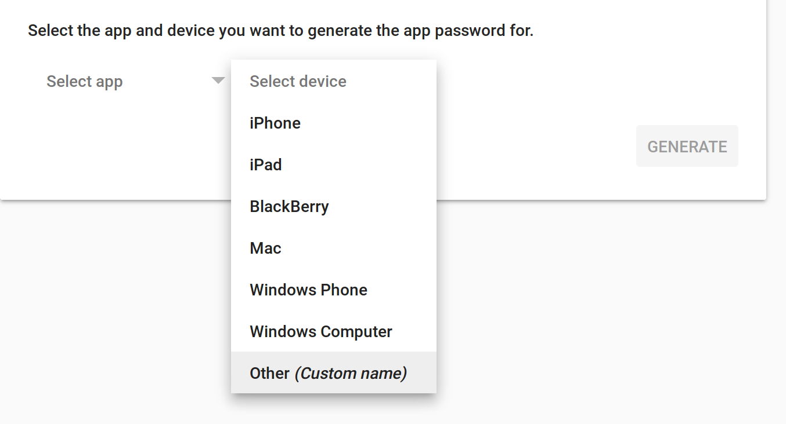
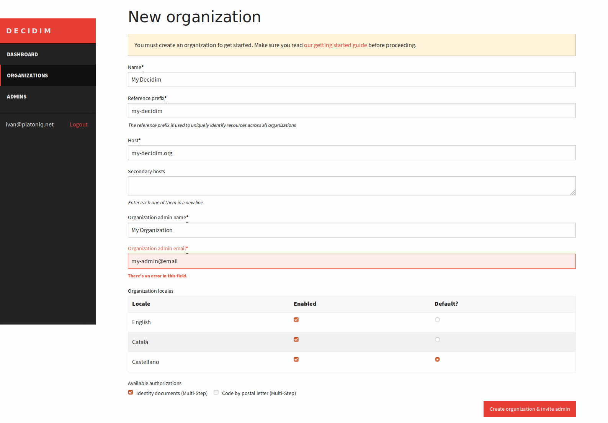
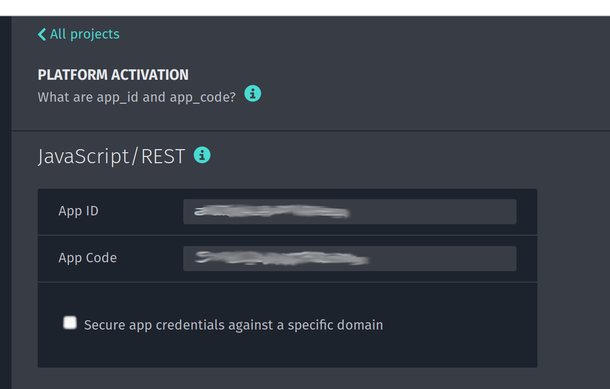

Basic configuration of Decidim
==============================

In this document, we'll finish the configuration of our installation of Decidim in order to make it capable of the most basic things, like sending emails. This configuration is independent of the operating system, that's why it's in a different file.

I'll assume here that you have a [running copy of Decidim](decidim-bionic.md) with empty content, no users or organizations created yet (a part from the system user admin created in the previous tutorial).

Email configuration
-------------------

The most important thing to configure is the capability for sending emails, otherwise users won't be able to register.

We'll configure here a Gmail account, which is suitable for small organizations in order to get started. Configure any other SMTP provider is analogous.

> **NOTE:** Gmail has a limit of [500 recipients](https://support.google.com/mail/answer/22839?hl=en) per day (10000 per day if you are using Gsuite) and, therefore, is not recommended for medium/large production sites.
>
> Another drawback of using Gmail is that the "From" field of the email is going to be rewritten no matter what we configure in Decidim. This is going to affect how the end users sees the sender.
>
> You can use external email providers like [Amazon SES or similar](https://alternativeto.net/software/amazon-ses-simple-email-service-/).

First, we need to configure our Gmail account in order to allow external SMTP activation. Gmail accounts may have SMTP sending disable by default if you have disabled the option "Enable less secure applications". In that case we need to create an application password for Decidim.

**Option 1**, enable "less secure applications".

Go to this link (logged into your Gmail account), and activate the checkbox "Allow less secure apps":

https://myaccount.google.com/lesssecureapps

Official instructions from Google are here:
https://support.google.com/accounts/answer/6010255?hl=en


**Option 2**, create an application specific password. If you have 2-factor authentication on your Gmail account you must choose this option.

1. Go to https://security.google.com/settings/security/apppasswords
and login using your Gmail account.
2. Create a new application password by selecting the option "Other" in the section "Device":<br><br>
3. A new window will appear with your password, copy it because you won't be able to read that password anymore once you close that window (you can always generate a news app password though).<br><br><br><br>Official documentation from Google is here:
https://support.google.com/mail/answer/185833?hl=en


We can now proceed to configure Decidim to use our credentials.

Let's edit our `application.yml` file and add some constants in that file:

```bash
nano ~/decidim-app/config/application.yml
```

Add these lines at the end, by using your own Gmail (or Gsuite) account and using your Gmail password if choosed the *Option 1* or the generated password in case of *Option 2*

```yaml
SMTP_USERNAME: my-decidim@gmail.com
SMTP_PASSWORD: suwbyijyxoppiwwz
SMTP_ADDRESS: smtp.gmail.com
SMTP_DOMAIN: gmail.com
```

If you are using Gsuite, replace `gmail.com` with your own domain (except in the line SMTP_ADDRESS).

> If you are using some other SMTP configuration you have more parameters to tweak under the file `config/secrets.yml`
>
> Check the section `production` on that file (for example, you may want to change the default port from `587` to `465`, `25`, etc)

Now, we need to add a processor to Ruby on Rails that will actually send the emails. There's several options here, as usually we are going to use the simplest one.

In our Gemfile (if you followed the previous guide), we added the Gem `delayed_job_active_record`, ensure that your `Gemfile` has it along with the `daemons` gem:

```ruby
group :production do
  gem "passenger"
  gem 'delayed_job_active_record'
  gem "daemons"
end
```

We need to setup the delayed_job gem, run these commands:

```bash
cd ~/decidim-app
bundle install
bin/rails generate delayed_job:active_record
bin/rake db:migrate
```

At this point, our system should be able to send emails, however, there's and additional file that should be configured to specify our "FROM" sender field. This is specially important if you don't use Gmail, because Gmail always overwrites that field to match the sender account.

So, edit the file `config/initializers/decidim.rb` and change the values `My Application Name` and `change-me@domain.org` values to match your own ones:

```bash
cd ~/decidim-app
nano config/initializers/decidim.rb
```

Search for these lines and change them to match your own values:

```ruby
...
Decidim.configure do |config|
  config.application_name = "My Application Name"
  config.mailer_sender = "change-me@domain.org"
...
```

Now, if you are using IPv6 in your system, you may encounter problems sending emails via external smtp servers (at least with Gmail). If you don't need IPv6 (if you don't know, chances are that you don't), I'd recommend to disable it. To do that edit the file `/etc/sysctl.conf`:

```nano
sudo nano /etc/sysctl.conf
```

And add at the end of the file these lines:

```ini
#disable ipv6
net.ipv6.conf.all.disable_ipv6 = 1
net.ipv6.conf.default.disable_ipv6 = 1
net.ipv6.conf.lo.disable_ipv6 = 1
```

Apply the changes to the system:

```bash
sudo sysctl -p
```

Finally, reload passenger with this command:

```bash
sudo passenger-config restart-app ~/decidim-app
```

Our system should be ready now, we can go to our Decidim `URL/system` login with our system manager user created in the previous tutorial and create our first organization. You'll see a window similar to this:



Once created you can start using Decidim, next steps are optional (but recommended).

### Debugging email problems

If you're your Decidim is not sending mails you need to find out the cause. Decidim has a log file, in our case it's placed in the folder `log` in our installation folder.

You can follow "live" everything that happens using the `tail` command:

```bash
tail ~/decidim-app/log/production.log -f
```
(Press CTRL-C to exit)

But we are interested in finding errors while sending emails, you can do it with grep:

```bash
grep ERROR ~/decidim-app/log/production.log -A3 -B3
```

If that gives you some results you may want to post an issue with the info.

For example, if you see something like this:

```
----==_mimepart_5b4f1d00c0e07_4b232aceae7075f418469--

E, [2018-07-18T12:57:34.801540 #19235] ERROR -- : [ActiveJob] [ActionMailer::DeliveryJob] [a0572a5f-6ed3-45dd-bc24-3568bc6f665b] Error performing ActionMailer::DeliveryJob (Job ID: a0572a5f-6ed3-45dd-bc24-3568bc6f665b) from Async(mailers) in 30203.2ms: Net::OpenTimeout (execution expired):
/home/decidim/.rbenv/versions/2.5.1/lib/ruby/2.5.0/net/smtp.rb:539:in `initialize'
/home/decidim/.rbenv/versions/2.5.1/lib/ruby/2.5.0/net/smtp.rb:539:in `open'
```

Then, you are probably suffering the IPv6 problem commented before.


Enabling SSL (with Let's encrypt)
---------------------------------

Although this is not mandatory in order to have Decidim working, in a practical way it is: SSL will give your users trust and it's free nowadays.

SSL ensures that you offer a secure site to your users (URL will start with `https://`) and the browsers won't annoy you with that "insecure page" message.

You can follow [this guide from DigitalOcean](https://www.digitalocean.com/community/tutorials/how-to-secure-nginx-with-let-s-encrypt-on-ubuntu-18-04) to configure Nginx with Let's Encrypt, here are the steps summarized:

We are going to use the official Certbot from the [Let's Encrypt](https://letsencrypt.org/) project.

First, we install the latests version with these commands:

```bash
sudo add-apt-repository -y ppa:certbot/certbot
sudo apt install -y python-certbot-nginx
```

The original guide has now some step to check our domain name and our firewall configuration, if you've followed the [previous tutorial](decidim-bionic.md) we have this already covered.

So, let's run the certbot script (change `my-decidim.org` with your own full URL):

```bash
sudo certbot --nginx -d my-decidim.org
```

You will have to answer 3 questions (write your email, accept the terms and choose if you want to be included in their newsletter). Once the script has collected your certificate, it will ask you if you want to redirect all `http` to `https`, I recommend to choose *yes* here so no further configuration will be needed in our Decidim install.

The output of the full command should be like this:

```
decidim@decidim:~$ sudo certbot --nginx -d my-decidim.org
Saving debug log to /var/log/letsencrypt/letsencrypt.log
Plugins selected: Authenticator nginx, Installer nginx
Enter email address (used for urgent renewal and security notices) (Enter 'c' to
cancel): ivan@platoniq.net

-------------------------------------------------------------------------------
Please read the Terms of Service at
https://letsencrypt.org/documents/LE-SA-v1.2-November-15-2017.pdf. You must
agree in order to register with the ACME server at
https://acme-v01.api.letsencrypt.org/directory
-------------------------------------------------------------------------------
(A)gree/(C)ancel: A

-------------------------------------------------------------------------------
Would you be willing to share your email address with the Electronic Frontier
Foundation, a founding partner of the Let's Encrypt project and the non-profit
organization that develops Certbot? We'd like to send you email about our work
encrypting the web, EFF news, campaigns, and ways to support digital freedom.
-------------------------------------------------------------------------------
(Y)es/(N)o: Y
Obtaining a new certificate
Performing the following challenges:
http-01 challenge for my-decidim.org
Waiting for verification...
Cleaning up challenges
Deploying Certificate to VirtualHost /etc/nginx/sites-enabled/decidim.conf

Please choose whether or not to redirect HTTP traffic to HTTPS, removing HTTP access.
-------------------------------------------------------------------------------
1: No redirect - Make no further changes to the webserver configuration.
2: Redirect - Make all requests redirect to secure HTTPS access. Choose this for
new sites, or if you're confident your site works on HTTPS. You can undo this
change by editing your web server's configuration.
-------------------------------------------------------------------------------
Select the appropriate number [1-2] then [enter] (press 'c' to cancel): 2
Redirecting all traffic on port 80 to ssl in /etc/nginx/sites-enabled/decidim.conf

-------------------------------------------------------------------------------
Congratulations! You have successfully enabled https://my-decidim.org

You should test your configuration at:
https://www.ssllabs.com/ssltest/analyze.html?d=my-decidim.org
-------------------------------------------------------------------------------

IMPORTANT NOTES:
 - Congratulations! Your certificate and chain have been saved at:
   /etc/letsencrypt/live/my-decidim.org/fullchain.pem
   Your key file has been saved at:
   /etc/letsencrypt/live/my-decidim.org/privkey.pem
   Your cert will expire on 2018-10-17. To obtain a new or tweaked
   version of this certificate in the future, simply run certbot again
   with the "certonly" option. To non-interactively renew *all* of
   your certificates, run "certbot renew"
 - Your account credentials have been saved in your Certbot
   configuration directory at /etc/letsencrypt. You should make a
   secure backup of this folder now. This configuration directory will
   also contain certificates and private keys obtained by Certbot so
   making regular backups of this folder is ideal.
 - If you like Certbot, please consider supporting our work by:

   Donating to ISRG / Let's Encrypt:   https://letsencrypt.org/donate
   Donating to EFF:                    https://eff.org/donate-le
```

The script also creates an entry in the crontab system to renew automatically the certificate every 3 months. Read the [original guide](https://www.digitalocean.com/community/tutorials/how-to-secure-nginx-with-let-s-encrypt-on-ubuntu-18-04) for more details.

What now? Nothing! That's it! You can point your browser to your URL and will see how your Decidim is served securely.

Setting up Oauth authentication
-------------------------------

By configuring OAuth, you'll be able to log into your installation of Decidim by using some well known providers, like Facebook, Google or Twitter.

I highly recommend to configure SSL before get into this step. You'll need to tell the providers about your full URL and that includes the `https://` part.

You can just follow the [original documentation](https://github.com/decidim/decidim/blob/master/docs/services/social_providers.md) from the core team of Decidim, but as we are using the gem `figaro` we'll modify the file `config/application.yml` instead of `config/secrets.yml`.

These are the original instructions tweaked to match our configuration:

### Facebook

1. Navigate to [Facebook Developers Page](https://developers.facebook.com/)
1. Follow the "Add a New App" link.
1. Click the "Website" option.
1. Fill in your application name and click "Create New Facebook App ID" button.
1. Fill in the contact email info and category.
1. Validate the captcha.
1. Ignore the source code and fill in the URL field with `https://YOUR_DECIDIM_HOST/users/auth/facebook/callback`
1. Navigate to the application dashboard and copy the APP_ID and APP_SECRET

### Twitter

1. Navigate to [Twitter Developers Page](https://developer.twitter.com/)
1. You need to apply for a Developer's account, will be guided during the process
1. Follow the "My apps" link.
1. Click the "Create New App" button.
1. Fill in the `Name`, `Description` fields.
1. Fill in the `Website` field with YOUR_DECIDIM_HOST value and the `Callback URL` field with `https://YOUR_DECIDIM_HOST/users/auth/twitter/callback`. If you are working on a development app you need to use `http://127.0.0.1:3000/` instead of `http://localhost:3000/`.
1. Check the 'Developer Agreement' checkbox and click the 'Create your Twitter application' button.
1. Navigate to the "Keys and Access Tokens" tab and copy the API_KEY and API_SECRET.
1. (Optional) Navigate to the "Permissions" tab and check the "Request email addresses from users" checkbox.


### Google

1. Navigate to [Google Developers Page](https://console.developers.google.com)
1. Follow the 'Create project' link.
1. Fill in the name of your app.
1. Navigate to the project dashboard and click on "Enable API"
1. Click on `Google+ API` and then "Enable"
1. Navigate to the project credentials page and click on `OAuth consent screen`.
1. Fill in the `Product name` field
1. Click on `Credentials` tab and click on "Create credentials" button. Select `OAuth client ID`.
1. Select `Web applications`. Fill in the `Authorized Javascript origins` with your url. Then fill in the `Authorized redirect URIs` with your url and append the path `/users/auth/google_oauth2/callback`.
1. Copy the CLIENT_ID AND CLIENT_SECRET

### Common steps

Once you've created your desired applications in the providers you want. You need to activate the variable `enabled` in the file `config/secrets.yml` for each configured service.

For instance, if we want the Facebook login, we need to edit the secion "default/ommiauth/facebook":

```bash
nano ~/decidim-app/config/secrets.yml
```

We will make sure it looks like this:

```yaml
...
default: &default
  omniauth:
    facebook:
      # It must be a boolean. Remember ENV variables doesn't support booleans.
      enabled: true
      app_id: <%= ENV["OMNIAUTH_FACEBOOK_APP_ID"] %>
      app_secret: <%= ENV["OMNIAUTH_FACEBOOK_APP_SECRET"] %>
...
```

Repeat the process for every service you want.

After that we need to add the env vars to our `config/application.yml` file.

```bash
nano ~/decidim-app/config/application.yml
```

Add the lines you need according to your services:

```yaml
# if you've enabled facebook:
OMNIAUTH_FACEBOOK_APP_ID: <your-facebook-app-id>
OMNIAUTH_FACEBOOK_APP_SECRET: <your-facebook-app-secret>
# if twitter:
OMNIAUTH_TWITTER_API_KEY: <your-twitter-api-key>
OMNIAUTH_TWITTER_API_SECRET: <your-twitter-api-secret>
# if google:
OMNIAUTH_GOOGLE_CLIENT_ID: <your-google-client-id>
OMNIAUTH_GOOGLE_CLIENT_SECRET: <your-google-client-secret>
```

Restart passenger and you're done:

```bash
sudo passenger-config restart-app ~/decidim-app
```

> Note if you are using ENV vars directly - as we do in AWS Elastic Beanstalk - You don't need to edit the file `config/application.yml` just create the appropiate ENV var in your instances.
>
> In Elastic Beanstalk the commands will be:
>
> ```bash
> eb setenv OMNIAUTH_FACEBOOK_APP_ID=*****
> eb setenv OMNIAUTH_FACEBOOK_APP_SECRET=*****
> eb deploy
> ```

Geolocation configuration
-------------------------

Configuring geolocation allows to specify real addresses and display the locations of meetings in maps.

The easiest way to setup geolocation is to create an account hi [Here Maps](https://www.here.com/en). Open next URL in your browser and register a developer account there:

https://developer.here.com/?create=Evaluation&keepState=true&step=account

Then obtain your API ID and Code from there, you should look for a place like this:



Now edit your `config/application.yml` again (or send the ENV vars in case you are not using the file `application.yml`):

```bash
nano ~/decidim-app/config/application.yml
```

And place these new extra lines at the bottom of the file:

```yaml
GEOCODER_LOOKUP_APP_ID: <your-App-ID>
GEOCODER_LOOKUP_APP_CODE: <your-App-Code>
```
Either you use ENV variables or the `config/application.yml` file, you need to uncomment the following lines from the file `config/initializers/decidim.rb`:

```ruby
  # config.geocoder = {
    #   static_map_url: "https://image.maps.cit.api.here.com/mia/1.6/mapview",
  #   here_app_id: Rails.application.secrets.geocoder[:here_app_id],
  #   here_app_code: Rails.application.secrets.geocoder[:here_app_code]
  # }
```
leave it like:

```ruby
  config.geocoder = {
    static_map_url: "https://image.maps.cit.api.here.com/mia/1.6/mapview",
    here_app_id: Rails.application.secrets.geocoder[:here_app_id],
    here_app_code: Rails.application.secrets.geocoder[:here_app_code]
  }
```
> Create a commit and push to remote if you are using GIT.

Restart passenger (or deploy) and you're ready to use maps geolocation in Decidim:

```bash
sudo passenger-config restart-app ~/decidim-app
```
