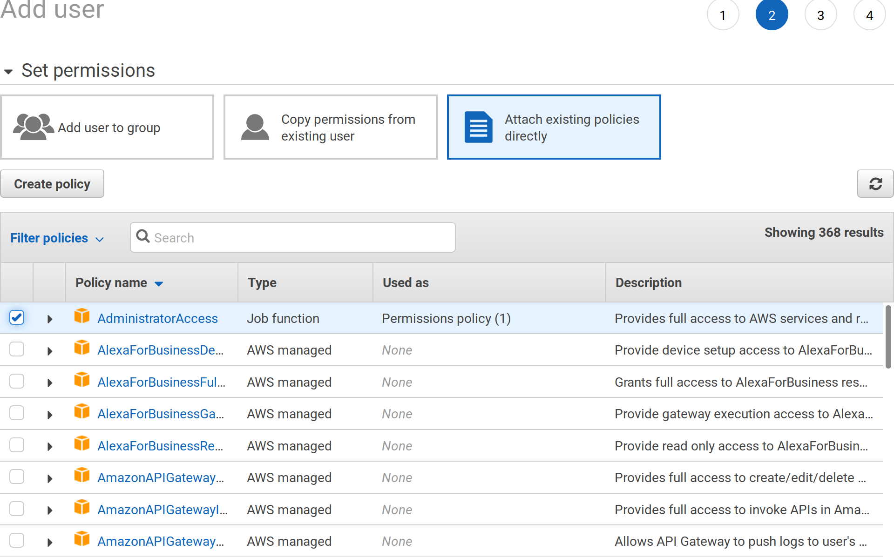

Install Decidim in Amazon AWS - ElasticBeanstalk
================================================

AWS Elastic Beanstalk is the Amazon Web Services solution for deploying and scaling web applications and services. Several languages are supported, Ruby included.

It's the AWS alternative has other PaaS like Heroku (probably the most popular option for Ruby on Rails applications). As AWS provides generous discounts for [non-profit organizations](https://aws.amazon.com/government-education/nonprofits/) this may be a very desirable cost-effective option for deploying Decidim for many organizations.

This guide is heavily inspired in this [nice guide](https://hackernoon.com/how-to-setup-and-deploy-a-rails-5-app-on-aws-beanstalk-with-postgresql-redis-and-more-88a38355f1ea) written by [Rob Face](https://hackernoon.com/@rob__race) but targeting Decidim specifically, I recommend reading it as I'll skip some comments regarding advantages/features and such from AWS.

### 1. Create your Decidim App

In the previous guide, we've created our Decidim app directly in the server. Although you can do that here, there's no much point doing it because ElasticBeanstalk is going to create the hosting servers for us.

So, the recommended way to go is to do all the subsequent commands in your local development machine (or use the docker alternative provide by Decidim). You are going to need to have everything related to ruby (and rails) installed.

If you are using Ubuntu 18.04 you can just execute:
```bash
sudo apt install -y ruby postgresql libpq-dev nodejs imagemagick rubygems-integration git
gem install decidim
decidim decidim-app
```
Change to the involved folder and initialize it as GIT repository (not optional any more):

```bash
cd ~/decidim-app
git init
git add .
git commit -m "My Decidim just created"
```

Check the [previous install guide](decidim-bionic.md) for more in-detail instructions.


## 2. Registering AWS and install the required tools

### 2.1 Registering in AWS

You are going to need an AWS account and install some command line tools in order follow this guide.

1. Go to https://portal.aws.amazon.com/billing/signup#/start and register an account un AWS. They'll give 12 months for free on many services (including those needed for this guide).

1. Create a key/secret credentials that will allow the command line authenticate an perform actions in the AWS API in your behalf.<br>Go to https://console.aws.amazon.com/iam/home?#/users and create a new user with programmatic access:


Attach administrative access to this user:



Grab your `access key ID` and `secret access key`, you'll be asked for those values later on:


### 2.2 Install the command line elasticbeanstalk:

In linux systems, use `pip` (the python manager, Python 2.7 required):
```bash
pip install awsebcli --upgrade --user
```

In MacOS you can use [homebrew](https://brew.sh/):
```bash
brew update
brew install aws-elasticbeanstalk
```

Be sure to have the tool properly installed:

```bash
$ eb --version
EB CLI 3.14.6 (Python 2.7.1)
```

Read the [official documentation](https://docs.aws.amazon.com/elasticbeanstalk/latest/dg/eb-cli3-install.html) about this tool is you have problems.


### Initialize ElasticBeanstalk

We are going to initialize ElasticBeanstalk in our Decidim copy, after that deploying will involve a simple command everytime we make a change.

```bash
cd ~/decidim-app
eb init
```