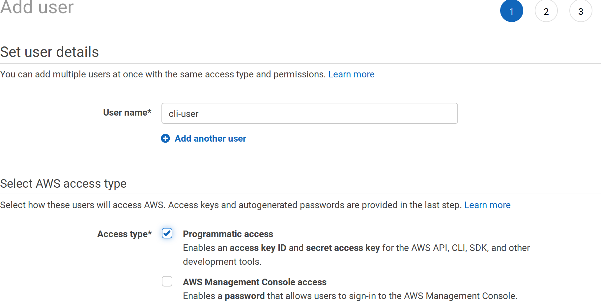
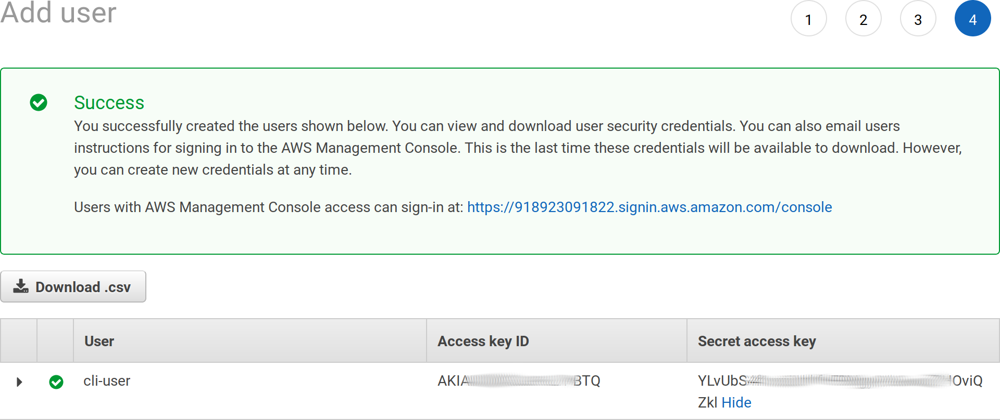
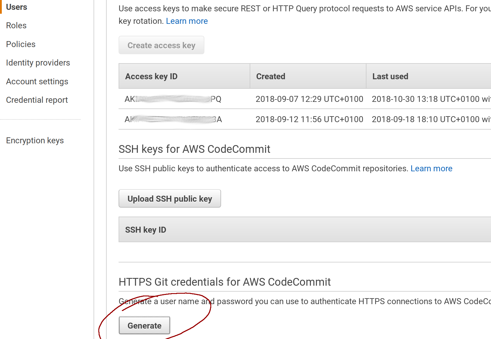
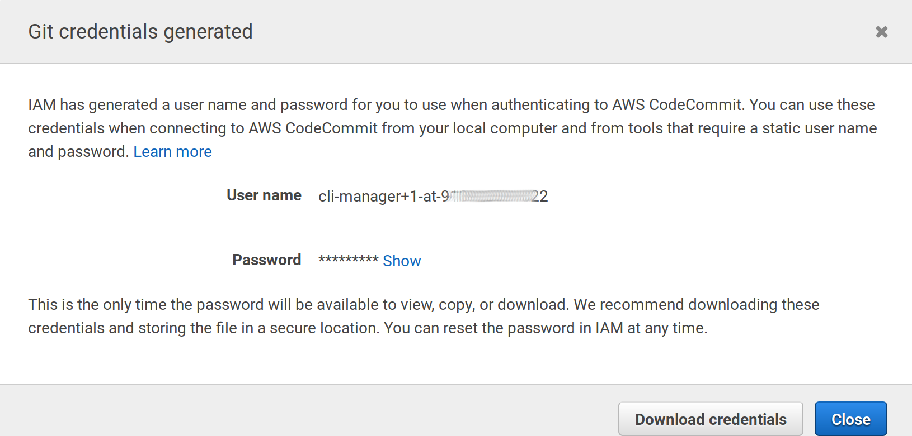
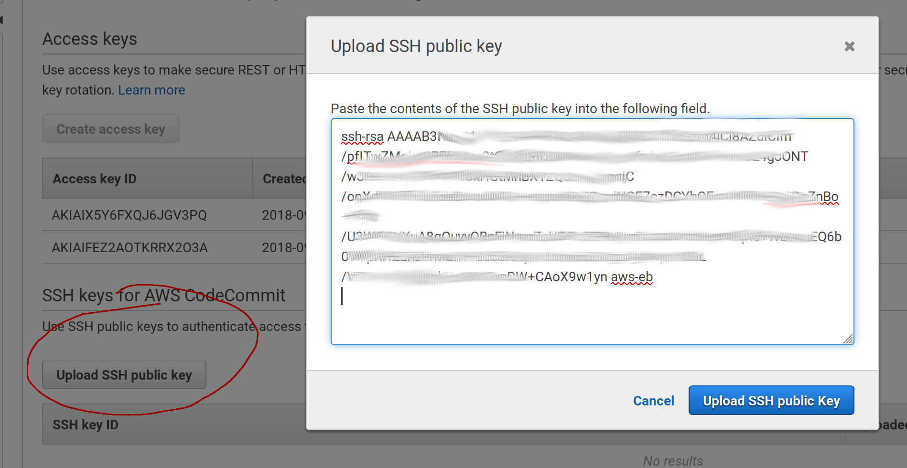
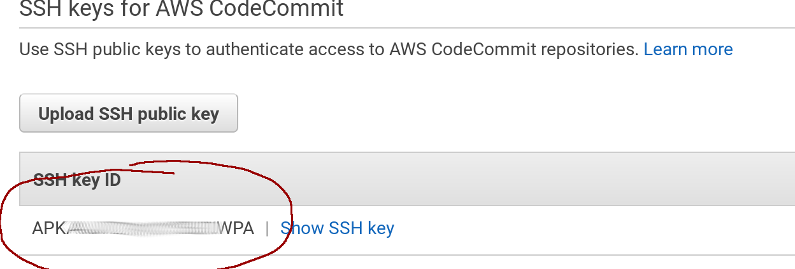
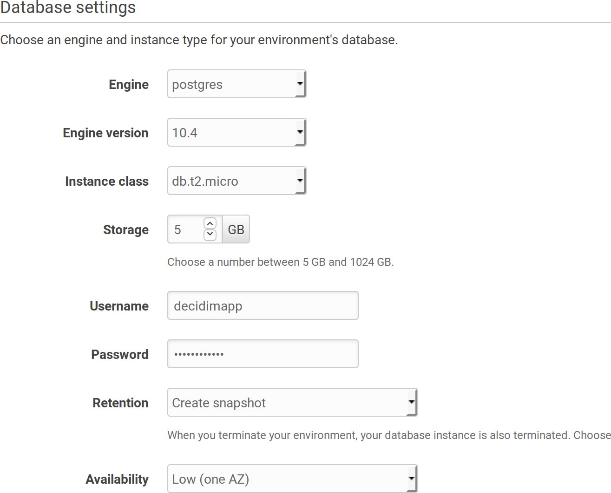
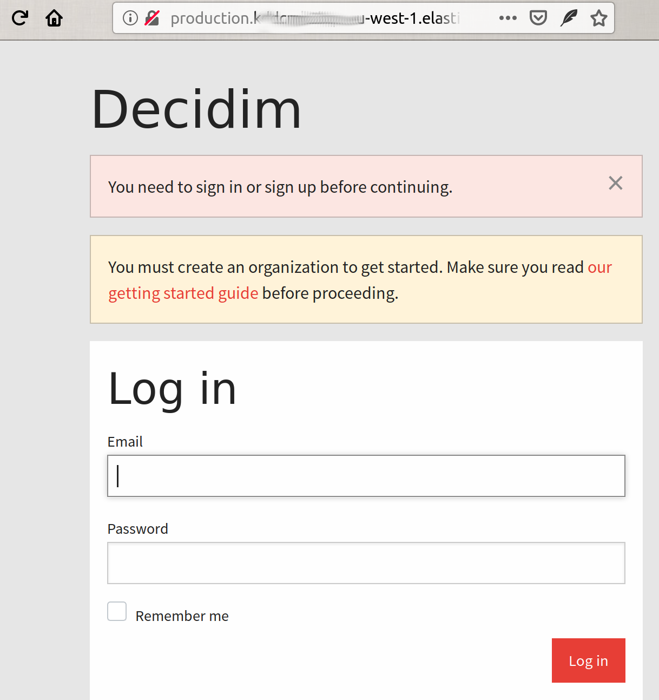

Install Decidim in Amazon AWS - ElasticBeanstalk
================================================

AWS Elastic Beanstalk is the Amazon Web Services solution for deploying and scaling web applications and services. Several languages are supported, Ruby included.

It's the AWS alternative has other PaaS like Heroku (probably the most popular option for Ruby on Rails applications). As AWS provides generous discounts for [non-profit organizations](https://aws.amazon.com/government-education/nonprofits/) this may be a very desirable cost-effective option for deploying Decidim for many organizations.

This guide is heavily inspired in this [nice guide](https://hackernoon.com/how-to-setup-and-deploy-a-rails-5-app-on-aws-beanstalk-with-postgresql-redis-and-more-88a38355f1ea) written by [Rob Face](https://hackernoon.com/@rob__race) but targeting Decidim specifically, I recommend reading it as I'll skip some comments regarding advantages/features and such from AWS.

### 1. Create your Decidim App

In the previous guide, we've created our Decidim app directly in the server. Although you can do that here, there's no much point doing it because ElasticBeanstalk is going to create the hosting servers for us.

So, the recommended way to go is to do all the subsequent commands in your local development machine (or use the docker alternative provide by Decidim). You are going to need to have everything related to ruby (and rails) installed.

If you are using Ubuntu 18.04 you can just execute:
```bash
sudo apt install -y ruby postgresql libpq-dev nodejs imagemagick rubygems-integration git
gem install decidim
decidim decidim-app
```
Change to the involved folder and initialize it as GIT repository (not optional any more):

```bash
cd ~/decidim-app
git init
git add .
git commit -m "My Decidim just created"
```

Check the [previous install guide](decidim-bionic.md) for more in-detail instructions.


## 2. Registering AWS and install the required tools

### 2.1 Registering in AWS

You are going to need an AWS account and install some command line tools in order follow this guide.

1. Go to https://portal.aws.amazon.com/billing/signup#/start and register an account un AWS. They'll give 12 months for free on many services (including those needed for this guide).

1. Create a key/secret credentials that will allow the command line authenticate an perform actions in the AWS API in your behalf.<br>Go to https://console.aws.amazon.com/iam/home?#/users and create a new user with programmatic access:



Attach administrative access to this user:


Grab your `access key ID` and `secret access key`, you'll be asked for those values later on:



We need to add additional permissions on that user, this is going to be needed later on as well when configuring our GIT repository:

Go to the `Security credentials` tab on the user summary detail and click the `Generate` button under *HTTPS Git credentials...*



Again, a new pair of user/password will be generated, save theses for later:



### 2.2 Install the command line elasticbeanstalk:

In Linux systems, use `pip` (the python manager, Python 2.7 required):
```bash
pip install awsebcli --upgrade --user
```

In MacOS you can use [homebrew](https://brew.sh/):
```bash
brew update
brew install aws-elasticbeanstalk
```

> If your are using Windows, I'd recommend to install to use the Windows Subsytem for Linux and use the Linux instructions when required:
> https://docs.microsoft.com/en-us/windows/wsl/install-win10

Be sure to have the tool properly installed:

```bash
$ eb --version
EB CLI 3.14.6 (Python 2.7.1)
```

Read the [official documentation](https://docs.aws.amazon.com/elasticbeanstalk/latest/dg/eb-cli3-install.html) about this tool is you have problems.


## 3. Initialize ElasticBeanstalk

We are going to initialize ElasticBeanstalk in our Decidim copy, after that deploying will involve a simple command everytime we make a change.

```bash
cd ~/decidim-app
eb init
```

This is going to ask many questions:

Choose a region (Choose 1 for free SSL services)

```
Select a default region
1) us-east-1 : US East (N. Virginia)
2) us-west-1 : US West (N. California)
3) us-west-2 : US West (Oregon)
4) eu-west-1 : EU (Ireland)
5) eu-central-1 : EU (Frankfurt)
6) ap-south-1 : Asia Pacific (Mumbai)
7) ap-southeast-1 : Asia Pacific (Singapore)
8) ap-southeast-2 : Asia Pacific (Sydney)
9) ap-northeast-1 : Asia Pacific (Tokyo)
10) ap-northeast-2 : Asia Pacific (Seoul)
11) sa-east-1 : South America (Sao Paulo)
12) cn-north-1 : China (Beijing)
13) cn-northwest-1 : China (Ningxia)
14) us-east-2 : US East (Ohio)
15) ca-central-1 : Canada (Central)
16) eu-west-2 : EU (London)
17) eu-west-3 : EU (Paris)
(default is 3): 4
```

Then you'll be asked to configure the credentials we've generated in the step **2.1**:
```
You have not yet set up your credentials or your credentials are incorrect
You must provide your credentials.
(aws-access-id): AKI**************BTQ
(aws-secret-key): YLvUbS****************OviQZkl
```

A name for your application in AWS (put whatever you want or leave empty for the default):

```
Enter Application Name
(default is "decidim-app"):
Application decidim-app has been created.
```

As docker is pre-configured in Decidim, EB will think it should use it, as I don't think is ready for production sites, answer **no**:

```
It appears you are using Docker. Is this correct?
(Y/n): n
```

Then choose the right platform (choose `Ruby` and `Ruby 2.5 (Passenger Standalone)`):

```
Select a platform.
1) Node.js
2) PHP
3) Python
4) Ruby
5) Tomcat
6) IIS
7) Docker
8) Multi-container Docker
9) GlassFish
10) Go
11) Java
12) Packer
(default is 1): 4

Select a platform version.
1) Ruby 2.5 (Passenger Standalone)
2) Ruby 2.5 (Puma)
3) Ruby 2.4 (Passenger Standalone)
4) Ruby 2.4 (Puma)
5) Ruby 2.3 (Passenger Standalone)
6) Ruby 2.3 (Puma)
7) Ruby 2.2 (Passenger Standalone)
8) Ruby 2.2 (Puma)
9) Ruby 2.1 (Passenger Standalone)
10) Ruby 2.1 (Puma)
11) Ruby 2.0 (Passenger Standalone)
12) Ruby 2.0 (Puma)
13) Ruby 1.9.3
(default is 1): 1
```

We're are going to use the CodeCommit service as a remote origin to our GIT repository, now we are going to be asked about the creation of that repository:

```
Note: Elastic Beanstalk now supports AWS CodeCommit; a fully-managed source control service. To learn more, see Docs: https://aws.amazon.com/codecommit/
Do you wish to continue with CodeCommit? (y/N) (default is n): y

Enter Repository Name
(default is "codecommit-origin"): decidim-app
Successfully created repository: decidim-app

Enter Branch Name
***** Must have at least one commit to create a new branch with CodeCommit *****
(default is "master"): master
```

Now we will be asked for a username to connect to the codecommit service, we are going to use the ones created in the `Security credentials` step, section **2.1** (Password won't be visible when you paste it):

```
Username for 'https://git-codecommit.eu-west-1.amazonaws.com/v1/repos/aws': cli-manager+1-at-9*******22
Password for 'https://cli-manager@git-codecommit.eu-west-1.amazonaws.com/v1/repos/aws':
Successfully created branch: master
```

Then, we need to configure SSH access to our instances, this step will generate a public/private rsa key. We are going to use this key to access the generated server without needing to type a password every time.

```
Do you want to set up SSH for your instances?
(Y/n): Y
Type a keypair name.
(Default is aws-eb):
Generating public/private rsa key pair.
Enter passphrase (empty for no passphrase):
Enter same passphrase again:
Your identification has been saved in /home/ivan/.ssh/aws-eb.
Your public key has been saved in /home/ivan/.ssh/aws-eb.pub.
The key fingerprint is:
SHA256:PK************************************ aws-eb
The key's randomart image is:
+---[RSA 2048]----+
|.. .o.+          |
|+.oo + .         |
|++= o o . o      |
|o= o = = B       |
|o . +.+ S =      |
|    o= o X o     |
|   ...E o +      |
|   ooo.o         |
|   .+oo          |
+----[SHA256]-----+
WARNING: Uploaded SSH public key for "aws-eb" into EC2 for region eu-west-1.
```

---

The `init` command will end here. Now, we could push our code to the server, but we will be asked for the password every time (because it's being configure as a HTTPS repository). To change that, we are going to change the generated GIT configuration file so we will use SSH configuration and use the previously generated key pair.

The generated key pair is stored in a hidden folder in your home directory (`/home/ivan/.ssh` in my case), to go there type:

```bash
cd ~/.ssh
```

You'll see there 2 files (at least), `aws-eb` and `aws-eb.pub`, you need to copy the content of the second one (`aws-eb.pub`).

In MacOS do:

```bash
pbcopy ~/.ssh/aws-eb.pub
```
In Linux:

```
xclip -selection clipboard ~/.ssh/aws-eb.pub
```

Then go to the IAM console of AWS (same place where we've created our user in section **2.1**) in https://console.aws.amazon.com/iam/home, edit our user under the `Secutiry credentials` section and click on the button `Upload SSH public key`. Paste the code copied and close the pop up.



Once uploaded, you'll get a new SSH Key ID, this is a username we are going to need in the next step:



Now we are going to reconfigure GIT in order to use SSH instead of HTTPS. You will need to run these 2 commands, but be aware that you may need to change the `eu-west-1` zone if you chose a different one in the beginning of section **3**:

```
git remote set-url codecommit-origin ssh://git-codecommit.eu-west-1.amazonaws.com/v1/repos/decidim-app
git remote set-url --push codecommit-origin ssh://git-codecommit.eu-west-1.amazonaws.com/v1/repos/decidim-app
```

As we've created a specific key pair for SSH authentication, we need to configure GIT globally in order to use those in the amazon servers. We must add these lines to the file `~/.ssh/config` (create the file if does not exists):

Use the editor `nano` (or another):

```bash
nano ~/.ssh/config
```

And paste the next lines by replacing the User code by the one created after uploading the SSH public key in the previous step:

```
Host git-codecommit.*.amazonaws.com
  User APK**************WPA
  IdentityFile ~/.ssh/aws-eb
```

You can test if everything is ok by creating a new commit after EB initialization:

```bash
$ git add .
$ git commit -m "Post EB init"
[master b999def] Post EB init
 1 file changed, 5 insertions(+), 1 deletion(-)
$ git push
Everything up-to-date
```

You may want to check the [official guide](https://docs.aws.amazon.com/codecommit/latest/userguide/setting-up-ssh-unixes.html) for further info.

## 4. Configure the environment in ElasticBeanstalk

We are going to create the environment, we can create as many as we want, typically: staging, development and production. In our case we will deal with the production one.

ElasticBeanstalk, let's run the command:

```bash
cd ~/decidim-app
eb create production
```

This is going to take a while...
The output will be something like this:

```
Starting environment deployment via CodeCommit
--- Waiting for Application Versions to be pre-processed ---
Finished processing application version app-b999-181030_184555
Setting up default branch
Environment details for: production
  Application name: decidim-app
  Region: eu-west-1

...

/opt/elasticbeanstalk/hooks/appdeploy/pre/11_asset_compilation.sh failed. For more detail, check /var/log/eb-activity.log using console or EB CLI.
2018-10-30 17:52:12    INFO    Command execution completed on all instances. Summary: [Successful: 0, Failed: 1].
2018-10-30 17:53:14    ERROR   Create environment operation is complete, but with errors. For more information, see troubleshooting documentation.
```

As you can see it failed while trying to deploy, but that's normal because we need to set up some environment variables. The production environment should be created anyway. We can test it by executing:

```
$ eb status
Environment details for: production
  Application name: decidim-app
  Region: eu-west-1
...
  Status: Ready
  Health: Red
Current CodeCommit settings:
  Repository: decidim-app
  Branch: master
```

Specifically, we need to specify the rails secret in a `env` variable:

```bash
eb setenv SECRET_KEY_BASE=$(rails secret)
```

The result should be:

```
018-10-30 18:00:07    INFO    Environment update is starting.
2018-10-30 18:00:16    INFO    Updating environment production's configuration settings.
2018-10-30 18:01:29    INFO    Successfully deployed new configuration to environment.
```

Now, we are going to create a database tied to ElasticBeanstalk. First, let's configure our Decidim application in order to use the proper credentials for that.

Edit the file `config/database.yml` in our `decidim-app` folder:

```bash
nano ~/decidim-app/config/database.yml
```

And paste this code (replace existing lines after `production:`):

```ruby
production:
    <<: *default
    adapter: postgresql
    encoding: unicode
    database: <%= ENV['RDS_DB_NAME'] %>
    username: <%= ENV['RDS_USERNAME'] %>
    password: <%= ENV['RDS_PASSWORD'] %>
    host: <%= ENV['RDS_HOSTNAME'] %>
    port: <%= ENV['RDS_PORT'] %>
```

And create a new commit:

```bash
git add .
git commit -m "set database config for EB"
git push
```

Now, let's create the AWS PostgreSQL database:

1. Go to https://console.aws.amazon.com/elasticbeanstalk/home?region=eu-west-1#/applications
1. Click on the `production` box under the `decidim-app` application
1. Click on `Configuration` in the left menu and then scroll down until the box `Database`, click on `modify`.
1. Create a PostgreSQL database, choose the instance (`db.t2.micro` for minimal costs), a username and a password: 
1. This is going to take a while as well...

> An alternative way to create the database is to go to the RDS section in AWS and create it there outside the scope of ElasticBeanstalk.
>
> This way, if you destroy your EB environment, your database won't be affected.
>
> This approach may be safer for some.


## 5. Deploying Decidim

When the database is created, we are ready to deploy our first version of Decidim, just type the command:

```bash
eb deploy
```

Result shoud be something like:
```
Starting environment deployment via CodeCommit
--- Waiting for Application Versions to be pre-processed ---
Finished processing application version app-b5ea-181031_105343
2018-10-31 09:53:53    INFO    Environment update is starting.
2018-10-31 09:53:58    INFO    Deploying new version to instance(s).
2018-10-31 09:57:36    INFO    New application version was deployed to running EC2 instances.
2018-10-31 09:57:36    INFO    Environment update completed successfully.
```

Great!! we are up an running! We can now navigate by using our provisional URL provided by AWS.

You can type in the console:

```bash
eb open
```

And your browser will open the page automatically. You will see the system login page:



Still many things need to be configured (main url, ssl email, first user, etc) though. We'll do that in the next section.

On the the other hand, once we initialized and configured ElasticBeanstalk, every time we make a modification in our code, we just need to create a GIT commit and deploy to EB, summarized:

```bash
git add .
git commit -m "My custom change"
git push
eb deploy
```

